# Teacher Tang Notion Sync

## Overview

Use this skill for the Teacher Tang video list workflow in this repository.

Core rule: if the Chrome / YouTube session is no longer signed in, stop before any local or Notion write and tell the user to sign in in Chrome and retry.

## When to Use

- The user asks to check the latest list.
- The user asks to scrape or harvest the latest Teacher Tang streams.
- The user asks to update `src/data/videos.json` from YouTube.
- The user asks to compare local video data with Notion.
- The user asks to update or sync the Teacher Tang Notion database.
- The task depends on the user's existing Chrome login state.

Do not use this skill for unrelated Notion work or generic YouTube research.

## Repository-Specific Targets

- YouTube source page: `https://www.youtube.com/@jessetang1113/streams`
- Local dataset to update first: `src/data/videos.json`
- Notion database title: `唐綺陽 Live 影片資料庫`
- Notion database ID: `50436c25-8185-4716-b9b0-6dc6a02ffc4f`
- Notion data source ID: `6d89c71a-0978-4181-a936-a532c253b203`

## Required Flow

```dot
digraph teacher_tang_sync {
    rankdir=LR;
    start [label="Start", shape=ellipse];
    check [label="Check Chrome / YouTube session", shape=box];
    signed_in [label="Signed in?", shape=diamond];
    stop_auth [label="Stop and ask user to sign in in Chrome", shape=box];
    harvest [label="Harvest completed streams from YouTube", shape=box];
    merge_local [label="Merge into local videos.json", shape=box];
    inspect_notion [label="Inspect Notion schema / target", shape=box];
    compare [label="Compare local dataset against Notion", shape=box];
    diff [label="Differences found?", shape=diamond];
    no_update [label="Report no update needed", shape=box];
    write_notion [label="Create or update only changed pages", shape=box];
    done [label="Done", shape=ellipse];

    start -> check;
    check -> signed_in;
    signed_in -> stop_auth [label="no"];
    signed_in -> harvest [label="yes"];
    stop_auth -> done;
    harvest -> merge_local;
    merge_local -> inspect_notion;
    inspect_notion -> compare;
    compare -> diff;
    diff -> no_update [label="no"];
    diff -> write_notion [label="yes"];
    no_update -> done;
    write_notion -> done;
}
```

## Step 1: Check Browser Session First

This is mandatory.

- Use Chrome, not a generic web fetch, because the task depends on the user's logged-in browser state.
- Reuse an existing Teacher Tang YouTube tab when possible.
- Otherwise open `https://www.youtube.com/@jessetang1113/streams`.
- Verify the page still shows a signed-in UI state.

Treat the session as valid only when the page clearly indicates the logged-in interface is present.

## Step 2: Hard Stop On Auth Failure

If the Chrome / YouTube session is missing, expired, or visibly signed out:

- stop the workflow immediately
- do not update `src/data/videos.json`
- do not create pages in Notion
- do not update pages in Notion
- do not claim the sync is complete

Tell the user exactly this in plain language:

`Chrome 裡的 YouTube 登入 session 已經掉了，請先在 Chrome 重新登入，然後再叫我重跑同步。`

## Step 3: Harvest Completed Streams From YouTube

- Open `https://www.youtube.com/@jessetang1113/streams`.
- Scroll until no additional completed stream entries appear.
- Treat the full page as the harvest scope, not just the initially visible rows.
- Only include completed stream replays.
- Exclude anything clearly marked as live now, upcoming, waiting room, or otherwise not yet finished.
- A usable YouTube link is enough to keep an entry in scope.

## Step 4: Merge Harvested Entries Into Local Data

- Read `src/data/videos.json`.
- Update the local dataset before any Notion comparison.
- Use normalized `url` as the primary identity key.
- Derive local `id` as `yt-<videoId>`.
- Add missing entries.
- If an entry with the same `url` already exists, keep existing curated values and only fill blank fields.
- Never delete local entries as part of routine sync.

When harvested fields are incomplete:

- if `title` is visible, use it
- if `title` is missing but `url` exists, create a placeholder title from the video ID
- if `date` cannot be determined, store `null`
- if `topics` cannot be determined, store `["其他"]`
- if `status` cannot be determined:
  - infer from visible title prefixes such as `【全會員】`, `【小聚落】`, `【會員專屬】`
  - otherwise default to `一般公開`

## Step 5: Inspect Notion Before Writing

Before any create or update:

- fetch the target database or data source
- confirm the active schema still includes:
  - `影片名稱`
  - `直播日期`
  - `YouTube 連結`
  - `Tags`

If the schema changed, stop and report it instead of guessing.

## Step 6: Compare Safely

Use exact matching by:

1. `影片名稱`
2. `YouTube 連結`

Check for these difference types:

- missing Notion page
- mismatched title
- mismatched date
- mismatched URL
- mismatched tags

Map local values like this:

- local `title` -> Notion `影片名稱`
- local `date` -> Notion `直播日期`
- local `url` -> Notion `YouTube 連結`
- local `topics` plus local `status` -> Notion `Tags`

## Step 7: Write Minimally

Only write when a concrete difference exists.

- Create missing pages.
- Update only the fields that differ.
- Never do bulk replacement.
- Never delete pages as part of routine sync.

## Quick Reference

| Check | Required action |
|---|---|
| Chrome / YouTube signed in | Continue |
| Chrome / YouTube signed out | Stop and ask user to sign in |
| Completed stream replay on `streams` page | Harvest and merge locally |
| Live or upcoming stream entry | Skip |
| Existing local entry with same URL | Fill blanks only |
| No differences found | Report no update needed |
| Differences found | Update only changed entries |
| Notion schema changed | Stop and report schema mismatch |

## Common Mistakes

- Checking Notion first and browser auth second.
- Treating a remembered session as valid without verifying the live page.
- Reading only the first visible row set instead of scrolling the full `streams` page.
- Importing live or upcoming items into `videos.json`.
- Overwriting curated local metadata with sparse harvested values.
- Writing to Notion after session failure.
- Guessing Notion schema names instead of fetching them.
- Updating the full database when only a few rows differ.

## Red Flags

- "The session was valid earlier, so it is probably still fine."
- "I can sync Notion first and check login later."
- "The first visible stream cards are probably enough."
- "Search results are enough; I do not need the `streams` page."
- "This item has no date or topic yet, so I should skip it even though the URL is valid."
- "I can keep going even if Chrome looks signed out."

If any of these appear, stop and restart from the session check.
